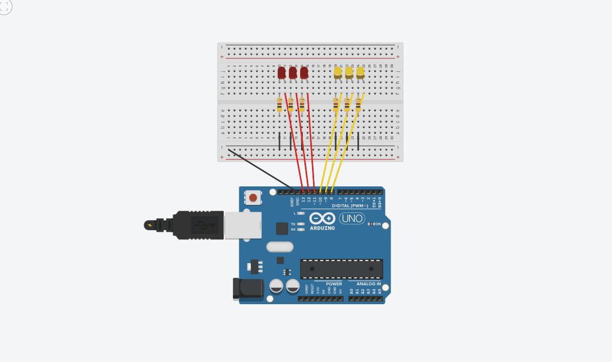

# Aula 03 - Introdução ao Arduino

Nesta aula, explorei o controle de saídas digitais utilizando o Arduino Uno para gerenciar múltiplos LEDs simultaneamente.

### 🛠️ Hardware
* Arduino Uno R3
* 6 LEDs (Vermelhos e Amarelos)
* 6 Resistores (Limitadores de corrente)
* Protoboard e Jumpers

### 🧠 O que aprendi
* **Saídas Digitais:** Uso do comando `digitalWrite(HIGH/LOW)` para controlar a passagem de 5V.
* **Resistores:** A importância de limitar a corrente para não queimar os componentes.
* **Organização de Código:** Uso de variáveis para nomear os pinos, facilitando a manutenção do circuito.
* **Lógica de Delay:** Controle de tempo de execução com a função `delay()`.

### 🎞️ Demonstração

---
*Projeto desenvolvido no Tinkercad para fins didáticos.*
