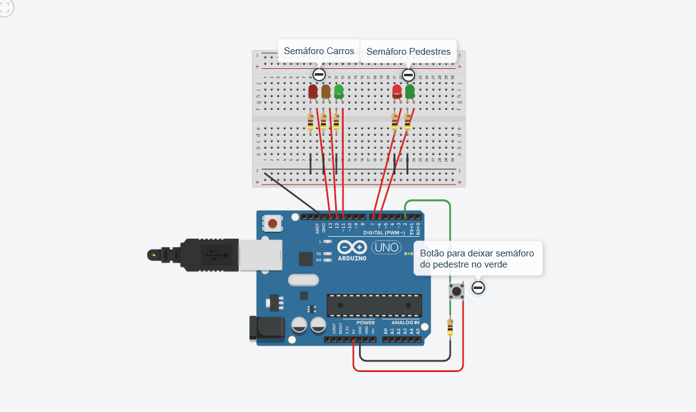

# Aula 04 - Semáforo Inteligente com Interrupção por Botão

Nesta aula, avancei para o uso de **entradas digitais**, criando um sistema de semáforo sincronizado para carros e pedestres que reage ao comando de um botão.

### 🛠️ Hardware
* Arduino Uno R3
* 5 LEDs (Verde, Amarelo e Vermelho para carros | Verde e Vermelho para pedestres)
* 6 Resistores (400Ω) para os LEDs e botão
* 1 Botão (Push button)
* Protoboard e Jumpers

### 🧠 O que aprendi
* **Entradas Digitais:** Uso do `digitalRead()` para captar o estado do botão.
* **Lógica de Controle (`if/else`):** O programa agora toma decisões baseadas no estado da entrada.
* **Temporização e Sequenciamento:** Criação de uma sequência lógica (Verde -> Amarelo -> Vermelho) com tempos específicos para garantir a segurança da travessia.
* **Laços de Repetição (`for`):** Implementação de um alerta visual (LED piscando) para indicar o fim do tempo de travessia do pedestre.
* **Configuração Pull-down:** Uso de um resistor para garantir que o pino do Arduino leia 0V (LOW) enquanto o botão não estiver pressionado, evitando ruídos.

### 🎞️ Demonstração

---
*Projeto desenvolvido no Tinkercad para fins didáticos.*
