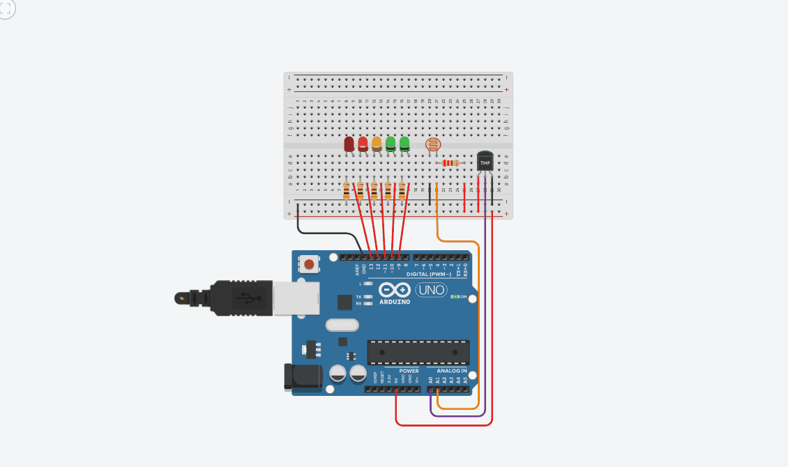

# Aula 05 - Termômetro em Barra com Ativação por Luminosidade

Nesta aula, desenvolvi um sistema de monitoramento de temperatura que utiliza cinco LEDs para representar diferentes faixas térmicas. O sistema possui um "gatilho de segurança" baseado em luz: os LEDs só funcionam se o ambiente estiver escuro.

### 🛠️ Hardware
* Arduino Uno R3
* Sensor de Temperatura TMP36
* Sensor de Luminosidade (LDR) com resistor de 220Ω
* 5 LEDs (2 Verdes, 1 Amarelo, 2 Vermelhos)
* Resistores de 400Ω para os LEDs

### 🧠 O que aprendi
* **Divisor de Tensão e LDR:** Ao utilizar um resistor de 220Ω, observei uma mudança na linearidade da leitura analógica (variando entre 713 e 1022), o que exigiu um ajuste fino na lógica do código.
* **Mapeamento de Sensores:** Uso da função `map()` para converter o sinal bruto do TMP36 (ajustado para a escala de 0 a 358 do simulador) para a temperatura em graus Celsius (-40°C a 120°C).
* **Lógica de Barra (Acumulativa):** Implementação de uma estrutura de `if/else if` que mantém os LEDs anteriores acesos conforme a temperatura sobe, criando um efeito visual de escala.
* **Condicional Mestra:** Uso de um `if` global que monitora o LDR para habilitar ou desabilitar todo o barramento de LEDs.

### 🎞️ Demonstração

---
*Projeto desenvolvido no Tinkercad para fins didáticos.*
