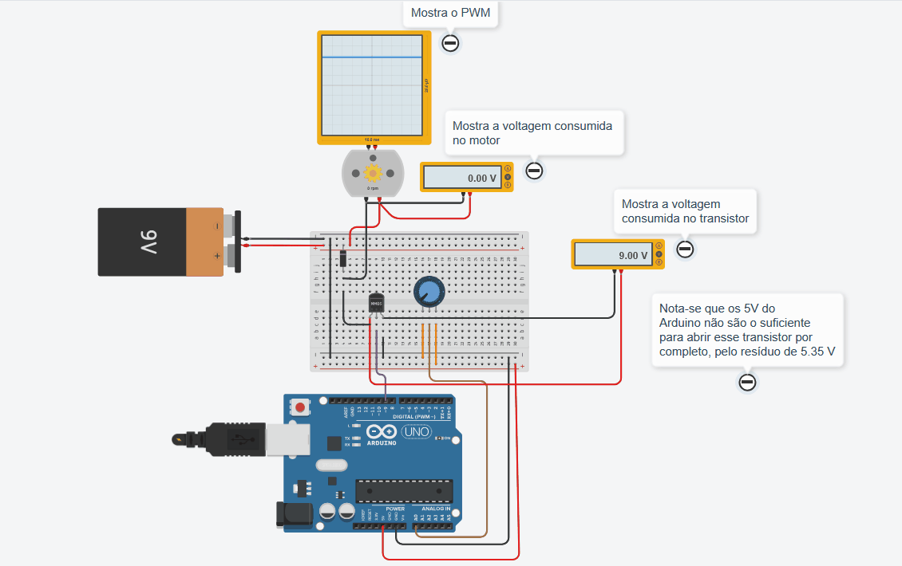

# Aula 07 - Controle de Motores DC e Modulação PWM

Nesta aula, explorei o controle de velocidade de um motor de corrente contínua (DC) utilizando um transistor como chave eletrônica e sinais PWM (Pulse Width Modulation).

### 🛠️ Hardware
* Arduino Uno R3
* Motor DC
* Transistor NMOS (MOSFET de canal N)
* Diodo de Proteção (Flyback Diode)
* Potenciômetro (Controle de velocidade)
* Bateria de 9V (Alimentação externa para carga)
* Osciloscópio e Multímetros para diagnóstico

### 🧠 O que aprendi
* **Controle PWM:** Uso do `analogWrite()` para variar o ciclo de trabalho (Duty Cycle) e, consequentemente, a velocidade média do motor.
* **Transistor como Chave:** Implementação do transistor para controlar uma carga que exige mais corrente e tensão (9V) do que os pinos do Arduino podem fornecer (5V/40mA).
* **Diodo de Roda Livre:** Importância do diodo em paralelo com o motor para proteger o circuito contra picos de tensão reversa gerados pela indução magnética.
* **Diagnóstico de Potência:** Através do uso de multímetros, observei que os 5V de saída do Arduino nem sempre são suficientes para levar o transistor à saturação total, resultando em uma queda de tensão residual no componente.

### 🎞️ Demonstração

---
*Projeto desenvolvido no Tinkercad para fins didáticos.*
